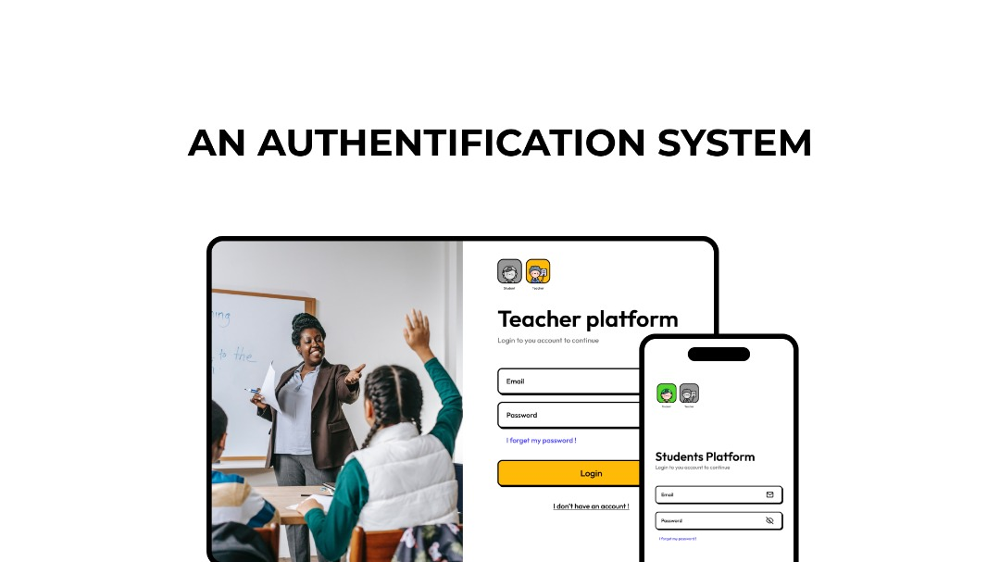
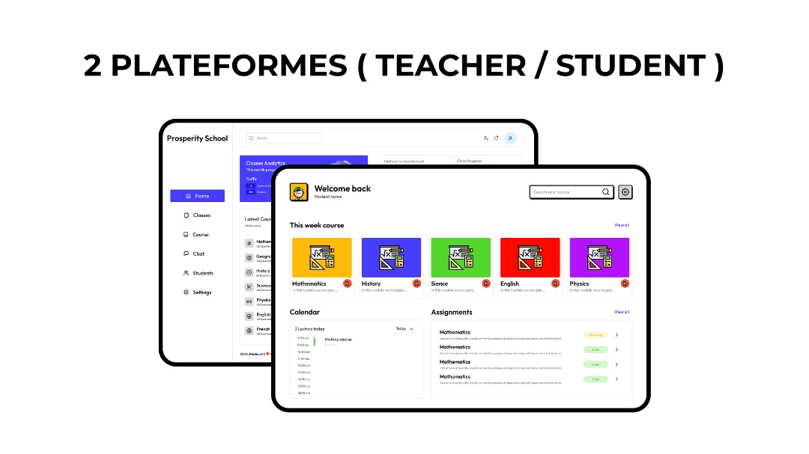
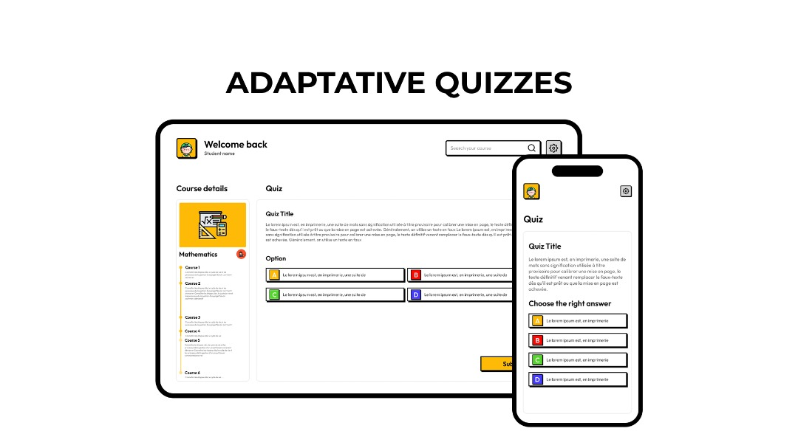

# 🎓 Liberty School – Full Stack Web App

A modern educational platform built with the **MERN stack**, enabling course management, assignments, quizzes, and real-time communication between teachers and students.

---

## 🌟 Table of Contents

- [🎯 Project Objective](#-project-objective)
- [🚀 Features](#-features)
- [🛠️ Technologies Used](#-technologies-used)
- [📁 Project Structure](#-project-structure)
- [🖼️ Screenshots](#-screenshots)
- [👩‍💻 The Team](#-the-team)
- [📦 Installation & Getting Started](#-installation--getting-started)
- [📌 Notes](#-notes)
- [💡 License](#-license)

---

## 🎯 Project Objective

To create an intuitive and responsive web platform that facilitates seamless interaction between teachers and students by offering:

- 📘 Classroom and content management  
- 📑 Assignment, quiz, and event creation  
- 💬 Real-time messaging system  
- 🔒 Role-based access with secure login

---

## 🚀 Features

### 👩‍🏫 Teacher Dashboard

- 🔐 Secure authentication  
- ➕ Create and manage:
  - 👨‍🎓Students
  - 🏫Classes  
  - 📚Courses  
  - 📝Assignments  
  - ❓Quizzes  
- 👁️ View student submissions and correct them  
- 💬 Real-time chat with students  

### 🧑‍🎓 Student Dashboard

- 🔐 Login & authentication  
- 🎓 Access materials by enrolled class (texts and videos)
- 📄 Full course details and advancement check  
- 📤 Submit & Update assignments  
- 📝 Take & Revise quizzes
- 🗓️ Create, Update & Delete events in a dedicated calendar
- ⏰ A well detailed time table  
- 💬 Live chat with teachers  

---

## 🛠️ Technologies Used

### 📦 Frontend

- **Next.js** (with Hooks)
- **TypeScript**
- **Tailwind CSS**
- **Socket.IO Client**
- **emoji-mart**
- **ShadCn**
- **Radix UI**
- **Remix Icon**

### 🧠 Backend

- **Node.js**
- **Express.js**
- **MongoDB** + **Mongoose**
- **Socket.IO Server**
- **Authentication**:
  - `bcrypt`  
  - `Cors`  
  - `cookie-parser`
- **Nodemailer**

### 🌐 Others

- **MongoDB Atlas**
- **Postman** – API testing
- **Git & GitHub** – version control
- **Vercel & Render** - Deploiyment 
---

## 📁 Project Structure

```bash
project-root/
│
├── api/                    # Backend application
│   ├── models/             
│   ├── routes/             
│   ├── controllers/        
│   ├── config/              
│   └── index.js           
│
├── my-app/                  # Frontend (React)
│   ├── public/
│   └── src/
│       ├── app/ 
│       ├── components/        
│       ├── hooks/          
│       ├── lib/
│       └── middleware.ts       
│
├── README.md
└── package.json


```

## 🖼️ Screenshots
<div style="display:flex; flex-direction: column; align-items: center; margin:30px 0px">
    
    <br/>
    
    <br/>
    
</div >

---

## 👩‍💻 The Team

- **Mohamed Riad Doukha**  
- **Kheniene Ghada**

---

## 📦 Installation & Getting Started

- **⚙️ Backend**
```bash
    cd Api
    npm install
    npm run dev

```
- **🌐 Frontend**

```bash
    cd my-app
    npm install
    npm install  @emoji-mart/react@1.1.1 --force
    npm run dev

```
## 📌 Notes

- 🛢️ **MongoDB** must be running locally or through **MongoDB Atlas**.
- 🔐 All **environment variables** are required for the app to function properly.
- 🔄 Real-time features such as **chat** rely on **WebSocket**, handled via **Socket.IO**.
- 🧪 Backend **APIs** can be tested using tools like **Postman**.

## 📄 License

Copyright © 2025 **Mohamed Riad Doukha** and **Ghada Kheniene**  
All rights reserved.

This software and associated documentation files (the "Software") are the exclusive property of **Mohamed Riad Doukha** and **Ghada Kheniene**.

You may not use, copy, modify, merge, publish, distribute, sublicense, or sell copies of the Software or any part of it without express written permission from the owners.

❗ Unauthorized use of this software is strictly prohibited and may result in legal action.

For licensing inquiries, please contact :  
📧 [doukhamohamedriad@gmail.com](mailto:doukhamohamedriad@gmail.com)
</br>
📧 [khenieneghada@gmail.com](mailto:khenieneghada@gmail.com)